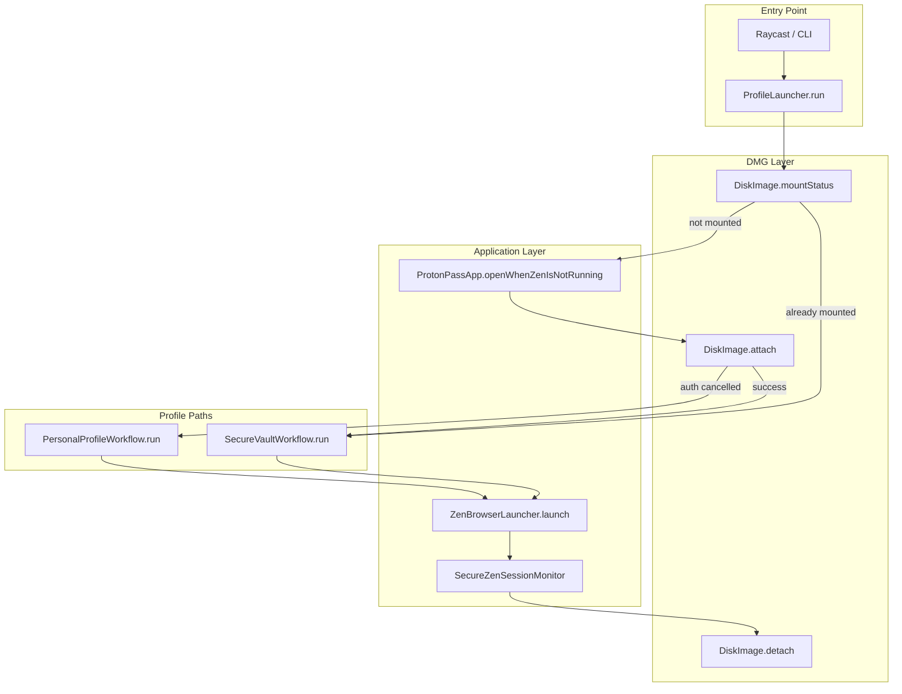
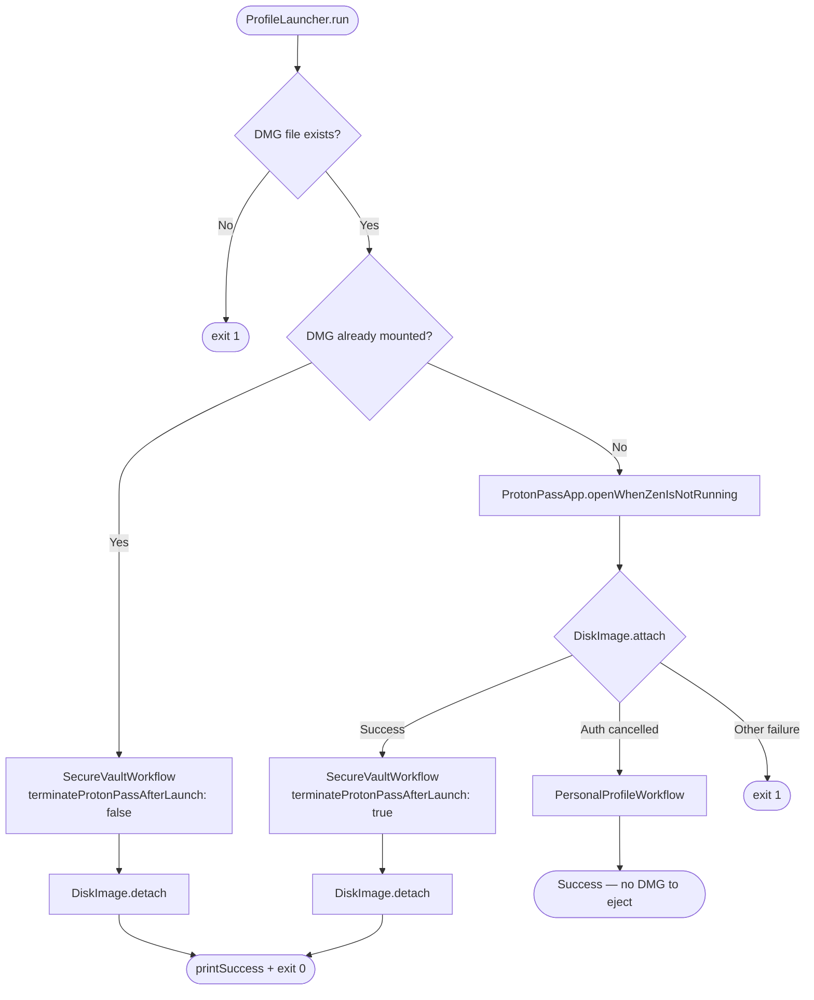
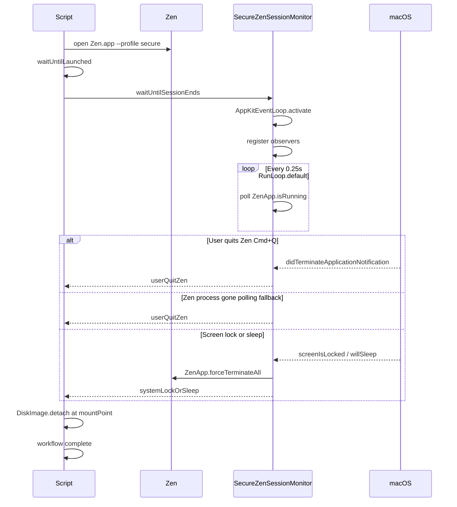
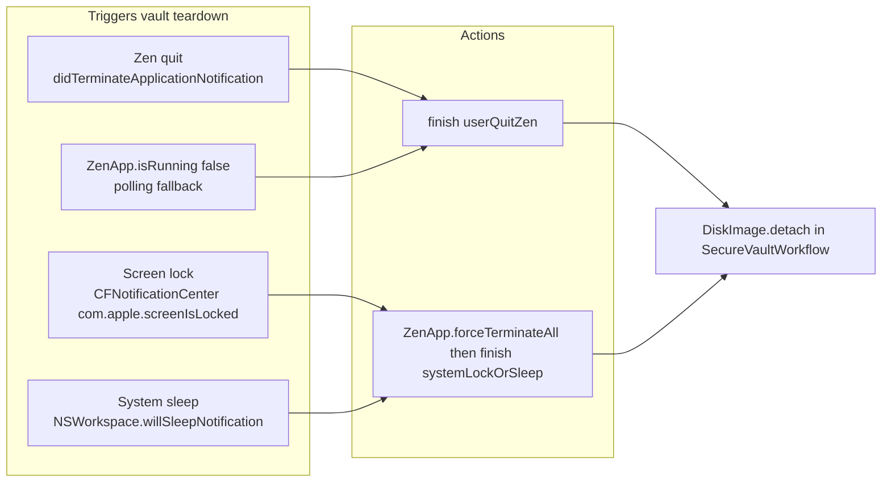
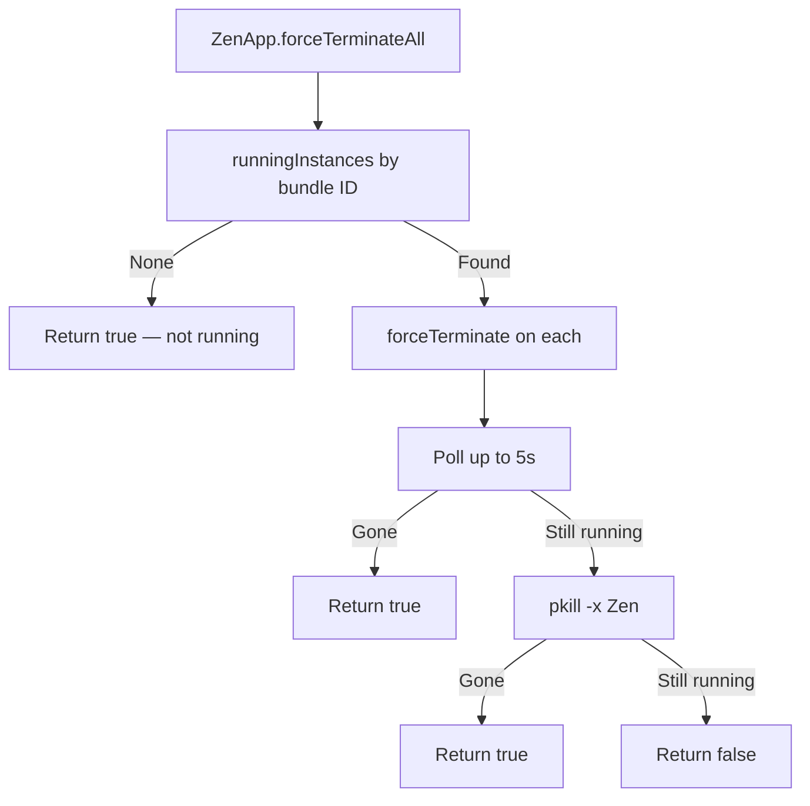

# პროფილი — Zen Secure Profile Launcher

Raycast script that mounts an encrypted DMG vault, launches Zen Browser with a secure profile, monitors the session for security events, and ejects the vault when the session ends.

**Source:** [`პროფილი.swift`](პროფილი.swift)

---

## Overview

| Property | Value |
|---|---|
| Raycast title | პროფილი |
| Mode | `silent` |
| Language | Swift (`#!/usr/bin/swift`) |
| Package | Utilities |
| Author | Johann-Goncalves-Pereira |

The script stays alive in the background while Zen is open on a **secure profile** (mounted DMG). It listens for macOS sleep, screen lock, and Zen quit events, then tears down the session and ejects the encrypted volume.

---

## High-Level Architecture



---

## Main Workflow Decision Tree



---

## Secure Profile Session Lifecycle

Only the **secure profile** path activates `SecureZenSessionMonitor`. The personal profile opens Zen in fire-and-forget mode with no monitoring and no DMG eject.



---

## SecureZenSessionMonitor — Event Sources



| Event | API | On trigger |
|---|---|---|
| Zen quit | `NSWorkspace.didTerminateApplicationNotification` | Finish monitor (`userQuitZen`) |
| Zen gone (fallback) | `ZenApp.isRunning` poll every 0.25s | Finish monitor (`userQuitZen`) |
| Screen lock | `CFNotificationCenter` → `Zen.screenLockedNotification` | Force-terminate Zen → finish (`systemLockOrSleep`) |
| System sleep | `NSWorkspace.willSleepNotification` | Force-terminate Zen → finish (`systemLockOrSleep`) |

> **Note:** Security monitoring applies **only** when `ZenBrowserLauncher.Session.monitoredSecureVault` is used. Personal profile uses `.immediate` and skips the monitor entirely.

---

## Configuration

All paths are defined in `Paths` inside [`პროფილი.swift`](პროფილი.swift):

| Constant | Path | Purpose |
|---|---|---|
| `Paths.encryptedVault` | `~/Library/Application Support/zen/Profiles/Profile.dmg` | Encrypted vault image |
| `Paths.protonPassApp` | `/Applications/Proton Pass.app` | Password manager (opened before mount) |
| `Paths.zenApp` | `/Applications/Zen.app` | Zen Browser |
| `Paths.secureProfile` | `/Volumes/Profile Secure/j3wki3fc.Secure` | Profile inside mounted DMG |
| `Paths.personalProfile` | `~/Library/Application Support/zen/Profiles/zi76byi5.Pesonal` | Fallback unencrypted profile |

Zen identifiers in `Zen`:

| Constant | Value |
|---|---|
| `zenBundleIdentifier` | `Zen.bundleIdentifier` (`app.zen-browser.zen`) |
| `zenProcessName` | `Zen.processName` (`Zen`) |

---

## Behavior Reference

### 1. DMG already mounted

- Skips Proton Pass launch.
- Skips killing Proton Pass (`terminateProtonPassAfterLaunch: false`).
- Opens Zen with secure profile.
- Monitors session until quit, lock, or sleep.
- Ejects DMG when session ends.

### 2. Fresh mount (happy path)

1. Opens Proton Pass (if Zen is not already running).
2. Runs `hdiutil attach` — macOS prompts for DMG password.
3. Kills Proton Pass after Zen opens.
4. Opens Zen with secure profile.
5. Monitors session.
6. Ejects DMG when session ends.

### 3. Mount cancelled / wrong password

- Detects auth errors in `hdiutil` output (`Authentication_Canceled`, `cancelled`, etc.).
- Falls back to **personal profile** (no DMG, no monitoring, no eject).
- Opens Zen with `ZenBrowserLauncher.Session.immediate` and returns immediately.

### 4. Mount failure (non-auth)

- Prints error and calls `exit(1)`.

### 5. DMG file missing

- Prints error and calls `exit(1)` before any mount attempt.

### 6. Zen manual quit (secure session)

- `SecureZenSessionMonitor` detects quit via notification or polling.
- Prints `Zen Browser operation completed successfully.`
- Prints `Zen session ended. Ejecting vault...`
- Runs `hdiutil detach`.

### 7. Screen lock or sleep (secure session)

- Monitor receives lock/sleep event.
- Prints `System sleep/lock detected — securing vault...`
- Force-terminates Zen via `NSRunningApplication.forceTerminate()` (falls back to `pkill -x Zen`).
- Prints `Vault secured due to system sleep or lock.`
- Ejects DMG.

### 8. Zen already running at start

- `ProtonPassApp.openWhenZenIsNotRunning` skips Proton Pass.
- `open` may focus the existing Zen instance instead of spawning a new one.

### 9. Personal profile fallback

- No `SecureZenSessionMonitor`.
- No DMG mount or eject.
- Zen opens and script exits immediately.

---

## Process Kill Strategy



---

## Logging Conventions

| Prefix | Function | Meaning |
|---|---|---|
| 🔧 | `Log.status` | Informational step |
| ✅ | `Log.success` | Successful operation |
| ❌ | `Log.error` | Error (may or may not abort) |

Raycast `silent` mode surfaces this output in the Raycast log / terminal when run via CLI.

---

## Dependencies & Requirements

- **macOS** with `hdiutil`, `open`, `pkill`, `pgrep`
- **Zen Browser** at `/Applications/Zen.app`
- **Proton Pass** (optional) at `/Applications/Proton Pass.app`
- **Encrypted DMG** at the configured `dmgPath`
- **AppKit** — imported for `NSWorkspace`, `NSRunningApplication`, run loop, and screen-lock notifications
- Script must **remain running** for the full secure session (Raycast waits until the script exits)

### Run loop constraint

The monitor uses `RunLoop.main.run(mode: .default, before:)` — **not** `.common`. Using `.common` as a run mode causes a CFRunLoop error and breaks event delivery.

---

## Manual Testing Checklist

| Scenario | Expected result |
|---|---|
| Mount DMG → use Zen → Cmd+Q | DMG ejects, script exits successfully |
| Already-mounted DMG path | Skips Proton Pass, monitors, ejects on quit |
| Lock screen (⌃⌘Q) during secure session | Zen killed, DMG ejected |
| Close lid / sleep during secure session | Zen killed, DMG ejected |
| Cancel DMG password prompt | Personal profile opens, no eject |
| Missing DMG file | Script exits with code 1 |
| Run from CLI: `./პროფილი.swift` | Same behavior as Raycast |

---

## File Structure (code map)

```
პროფილი.swift
├── Paths / Zen / SystemPaths          — paths and identifiers
├── Log / FileSystem                   — logging and filesystem helpers
├── ProcessRunner                      — shell command execution
├── DiskImagePlist models              — hdiutil plist parsing
├── DiskImage                          — attach, detach, mount status
├── AppKitEventLoop                    — CLI notification bootstrap
├── ZenApp / ProtonPassApp             — process lifecycle
├── SecureZenSessionMonitor            — sleep / lock / quit monitoring
├── ZenBrowserLauncher                 — open Zen (monitored or immediate)
├── SecureVaultWorkflow                — secure profile + eject
├── PersonalProfileWorkflow            — fallback profile
└── ProfileLauncher                    — entry orchestrator
```

---

## Maintaining This Document

**Update [`პროფილი-README.md`](პროფილი-README.md) whenever you change [`პროფილი.swift`](პროფილი.swift).** Treat the README as part of the same change — do not merge script changes without updating the docs.

### When to update

| Change in script | Sections to update |
|---|---|
| New/removed path in `Paths` | Configuration table |
| New workflow branch in `ProfileLauncher` | Main Workflow Decision Tree diagram + Behavior Reference |
| New monitor event or removed observer | SecureZenSessionMonitor diagram + Event Sources table |
| Changed kill/eject/mount logic | Process Kill Strategy + relevant behavior item |
| New Raycast metadata comments | Overview table |
| Changed `ZenBrowserLauncher.Session` / profile logic | Secure Profile Session Lifecycle + Behavior Reference |
| New exit codes or error handling | Behavior Reference + Testing Checklist |
| Renamed functions or restructured MARK sections | File Structure code map |

### Update checklist

1. Read the full diff of `პროფილი.swift`.
2. Identify which behaviors, paths, or events changed.
3. Update the affected **diagrams** (mermaid blocks must use valid syntax: no spaces in node IDs, no HTML in labels).
4. Update the **tables** and **behavior list** to match the new logic exactly.
5. Add or remove **test scenarios** if behavior changed.
6. Verify diagrams still reflect the real call order (especially `SecureVaultWorkflow` → `ZenBrowserLauncher` → `SecureZenSessionMonitor` → `DiskImage.detach`).

### Diagram rules used here

- `flowchart` for decision trees and architecture.
- `sequenceDiagram` for time-ordered secure session flow.
- Node IDs use camelCase without spaces (e.g. `CheckMounted`, not `Check Mounted`).
- Edge labels use `\n` for line breaks inside node text where needed.

### Quick validation after edits

```bash
# Typecheck the script
swiftc -typecheck პროფილი.swift -framework AppKit -framework Foundation

# Run manually and walk through the testing checklist above
./პროფილი.swift
```

If a diagram no longer matches a function name or flow in the source file, the README is out of date — fix it before considering the change complete.
